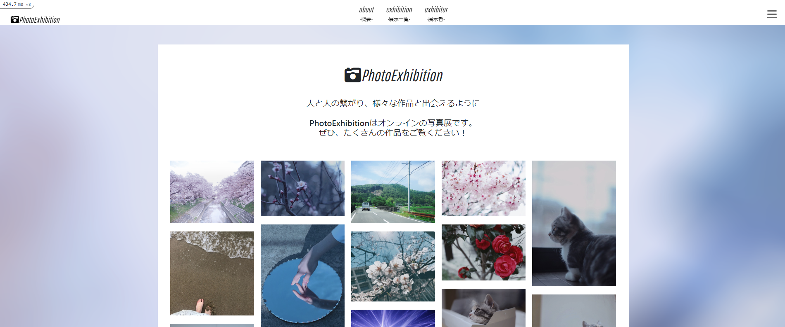

# PhotoExhibition

## サイト概要

### サイトテーマ
様々な個性あふれる作品と出会えるようなコミュニティサイト

### テーマを選んだ理由
友人に写真を撮ることを趣味として活動している方が多く、SNSだけでは素敵な写真が一部の人の目にしか留まらない現状や展示会に参加したいが準備や費用がかかってしまうことで断念してしまう方に気軽に自分の作品をたくさんの人に見てもらえるようなサイトを作りたかったからです。また、昨今の感染症の影響で室内での開催が難しくなっている問題をオンラインでの場所を作ることで見る側も一つの作品を好きなだけ時間をかけて見ることができるからです。

### ターゲットユーザ
- 写真撮影を趣味にしている方
- 写真を見ることが好きな方
- 自分の作品を展示したい方
- いろんな作品に出合いたい方

### 主な利用シーン
- 自分で撮影した写真を見てほしいとき
- 新たなインスピレーションを受けたいとき
- お気に入りの写真家を見つけたいとき

## 設計書
- [画面遷移図(顧客側)](https://drive.google.com/file/d/1X5miq0CPEyeIIZaiR01PN2n5P_6Hzd6l/view?usp=sharing)
- [画面遷移図(管理者側)](https://drive.google.com/file/d/1rEpz54Ej614E20qf4CetxMuLAfWa-Hf-/view?usp=sharing)
- [ER図](https://drive.google.com/file/d/1165D98rUOL-H_bTJJ5rEYMRxxgZZOX8y/view?usp=sharing)
- [ワイヤーフレーム(顧客側)](https://drive.google.com/file/d/1A0qhH1Pzjz-sdHwCPiSAZbTQxQUSeF8d/view?usp=sharing)
- [ワイヤーフレーム(管理者側)](https://drive.google.com/file/d/1D5jxT-ocPJmDjnJBhebWpvxXHB3k0rje/view?usp=sharing)
- [テーブル定義書](https://docs.google.com/spreadsheets/d/1Nq1pOGwmsaQbaaCApTT-ztqpGjtkxGF6OxQL-m2mOpQ/edit?usp=sharing)
- [アプリケーション詳細設計書](https://docs.google.com/spreadsheets/d/1OHW4JxDyZ9YZ1a3aFkXJj72zGCTd5WA4i9_LvRPX0Xw/edit?usp=sharing)

## 開発環境
- OS：Linux(CentOS)
- 言語：HTML,CSS,JavaScript,Ruby,SQL
- フレームワーク：Ruby on Rails
- JSライブラリ：jQuery
- IDE：Cloud9

## 使用素材
- 自分で撮影した写真と友人に使用許可を得て頂いた友人が撮影した写真等